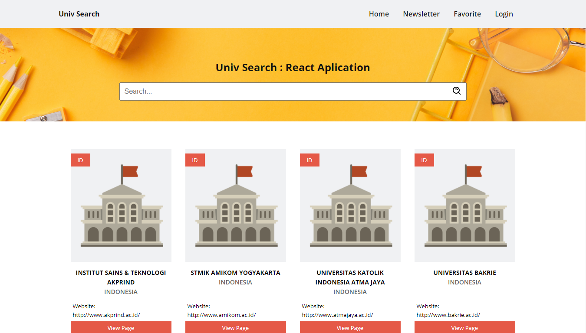

# Univ Search
> Univ search is an application to search for universities in Indonesia. This project was created in the context of a challenge front end assessment within 3 days at Xendit. I hope you like it and also i can work on Xendit!

## Table of contents
* [General info](#general-info)
* [Screenshots](#screenshots)
* [Technologies](#technologies)
* [Setup](#setup)
* [Features](#features)
* [Status](#status)
* [Inspiration](#inspiration)
* [Contact](#contact)

## General info
the data used in this project uses api https://github.com/Hipo/university-domains-list. In this project the data is specified for universities in Indonesia only. To change the university data from the desired country or around the world, you can change the homePage file.

* link for country specific : http://universities.hipolabs.com/search?country=(input country}
* links for worldwide : http://universities.hipolabs.com/search?

## Screenshots

## Technologies
* boxicons: "^2.0.7"
* firebase: "^8.1.2"
* node-sass: "^4.14.1",
* react: "^17.0.1",
* react-dom: "^17.0.1",
* react-redux: "^7.2.2",
* react-router-dom: "^5.2.0",
* react-scripts: "4.0.1",
* web-vitals: "^0.2.4"

## Setup
* npm install --save boxicons firebase node-sass@4.14.1 react react-dom react-redux react-router-dom react-scripts web-vitals
* create a firebase project and input your API Key in config.js at Firebase folder

## Features
* Search feature
* Newsletter feature
* Login with google

To-do list:
* Improvement in pagination
* Complete subscription component
* Connect login with facebook and twitter
* Complete Favorite Route
* Testing App
* Improve in documentation
* Need more picture university data

## Status
Project is: still need more improvement because due to time constraints, there are still many gaps that can be developed

## Inspiration
Add here credits. Project inspired by Xendit, based on Test Front End at Xendit

## Contact
Created by [@alifnl11](www.instagram.com/alifnl) - feel free to contact me!
